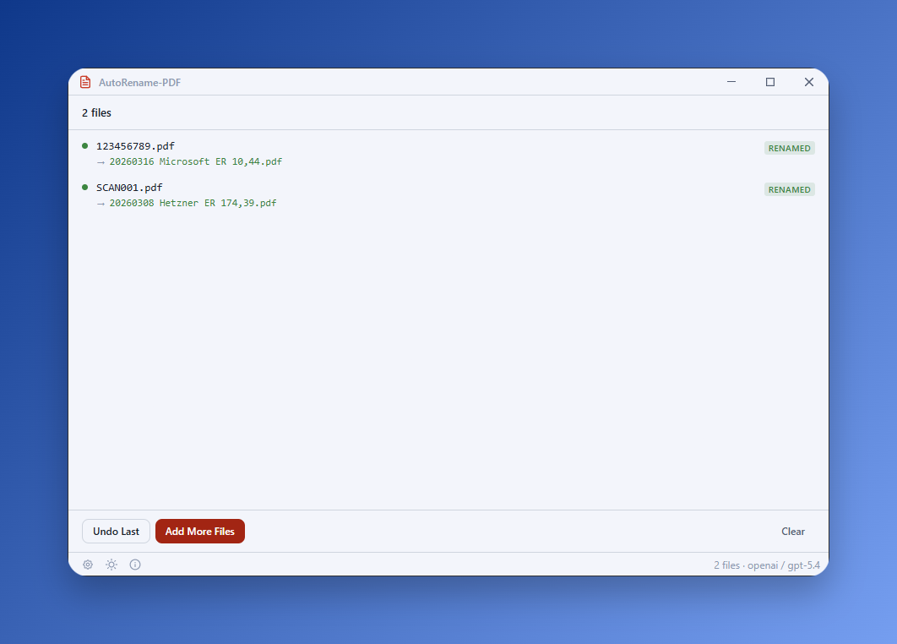

# AutoRename-PDF

**AutoRename-PDF** is a Windows desktop tool that automatically renames PDF documents based on their content. Using AI and OCR, it extracts company names, dates, and document types to create organized filenames like `20230901 ACME ER.pdf` — simplifying document management for businesses handling large volumes of PDFs.

**Current version: v2.1.2**



> **Upgrading from an earlier version?** This release has breaking changes — your old `config.yaml` will not work.
>
> - **Private AI / Private GPT removed** — use `ai.provider: "ollama"` for free local inference instead
> - **Config schema restructured** — all keys changed (e.g., `openai.api_key` → `ai.api_key`). See `config.yaml.example`
> - **Multi-provider AI** — now supports OpenAI, Anthropic, Gemini, xAI, and Ollama
> - **Extraction modes replaced** — `extraction_mode` / `ocr_fallback` → independent `pdf.ocr` and `pdf.vision` settings
>
> **To migrate:** Delete your old `config.yaml`, copy `config.yaml.example`, and fill in your values.

## Features

-   **Desktop GUI** — Drag-and-drop interface with dry-run preview, undo, and light/dark theme
-   **Automatic PDF Renaming** — Extracts metadata and renames PDFs to `YYYYMMDD COMPANY DOCTYPE.pdf`
-   **Multi-Provider AI** — Supports OpenAI, Anthropic (Claude), Google Gemini, xAI (Grok), and Ollama (local/private)
-   **Flexible Extraction** — Text extraction always runs; OCR and vision are independent add-ons you enable as needed
-   **Dry Run & Undo** — Preview renames before applying, reverse them if needed
-   **Batch Processing** — Rename multiple PDFs in folders, optionally recursive
-   **Context Menu Integration** — Right-click files or folders in Windows Explorer
-   **Company Name Harmonization** — Standardizes company names using customizable fuzzy-matching mappings
-   **Customizable Output** — Configure date formats, language, invoice codes, and extend the AI prompt

## Getting Started

### Download

Download the latest release from [GitHub Releases](https://github.com/ptmrio/autorename-pdf/releases).

-   **Portable ZIP** (`AutoRename-PDF-Portable-{version}.zip`) — extract and run, no installation needed

### What's in the Release

| File | Purpose |
|------|---------|
| `autorename-pdf-gui.exe` | Desktop GUI (primary interface) |
| `autorename-pdf-cli.exe` | CLI + context menu integration |
| `setup.ps1` | Registers context menu entries, optionally installs PaddleOCR |
| `config.yaml.example` | Configuration template — copy to `config.yaml` |
| `harmonized-company-names.yaml.example` | Company name mapping template |

### Setup Steps

1. **Extract the ZIP** to your desired location
2. **Run `setup.ps1`** — right-click → "Run with PowerShell" (auto-elevates to Admin via UAC)
3. **Edit `config.yaml`** with your AI provider and API key

The setup script will:

-   Create `config.yaml` from the example template
-   Add context menu entries for PDFs and folders
-   Optionally install **PaddleOCR** (~500 MB) for offline OCR of scanned documents

> **Windows 11 Note:** Context menu entries appear under "Show more options" (Shift+F10).

## Configuration

### API Key Setup

There are two ways to configure your API key:

**Method 1 — Directly in `config.yaml`** (simple, portable):

```yaml
ai:
  api_key: "sk-your-actual-key-here"
```

**Method 2 — Via environment variable** (secure, easy to switch providers):

```yaml
ai:
  api_key: "${OPENAI_API_KEY}"
```

Then create a `.env` file next to your `config.yaml`:

```
OPENAI_API_KEY=sk-your-actual-key-here
ANTHROPIC_API_KEY=sk-ant-your-key-here
```

The `${VAR_NAME}` syntax works in any string value in `config.yaml`. A `.env` file placed next to `config.yaml` is loaded automatically — no extra setup needed.

> **Tip:** Method 2 makes it easy to switch between providers without editing `config.yaml` — just update the `.env` file or set environment variables in your shell.

See `.env.example` for a template.

### Recommended Setups

Text extraction (pdfplumber) **always runs** — it's free and instant. OCR and vision are independent add-ons you enable based on your hardware and privacy needs.

#### Scenario 1: Modern Workstation — Cloud AI + PaddleOCR

Best accuracy. PaddleOCR runs locally for free, cloud AI handles the smart extraction. Works great for mixed document types (digital + scanned).

```yaml
ai:
  provider: "openai"           # or anthropic, gemini, xai
  model: "gpt-5.4"
  api_key: "your-api-key"
pdf:
  ocr: true                    # PaddleOCR enhances scanned docs
  vision: false                # not needed — OCR covers it
```

**Cost:** ~$0.001 per PDF (API text call only). **Requires:** API key + PaddleOCR installed (~500 MB, via `setup.ps1`).

#### Scenario 2: Lightweight / No Local Setup — Cloud AI + Vision

No PaddleOCR needed. The LLM reads page images directly. Great for laptops or when you don't want to install OCR.

```yaml
ai:
  provider: "gemini"           # or openai, anthropic, xai
  model: "gemini-3.1-flash-lite"
  api_key: "your-api-key"
pdf:
  ocr: false
  vision: true                 # send page images to LLM
```

**Cost:** ~$0.002 per PDF (API vision call). **Requires:** API key + vision-capable model.

#### Scenario 3: Max Privacy — Ollama + PaddleOCR

Everything runs on your machine. No data leaves your computer, no API keys, no cost per request.

```yaml
ai:
  provider: "ollama"
  model: "qwen3:4b"            # fast, fits in 3 GB VRAM
  api_key: ""
pdf:
  ocr: true                    # PaddleOCR for scanned docs
  vision: false                # text models are faster
```

**Cost:** Free. **Requires:** Ollama + a pulled model + PaddleOCR installed. See [Ollama Setup](#ollama-setup-free-local-ai) below.

### Extraction Settings Reference

| Setting | Values | Description |
|---------|--------|-------------|
| `pdf.ocr` | `false` / `true` / `"auto"` | PaddleOCR for scanned PDFs |
| `pdf.vision` | `false` / `true` / `"auto"` | Send page images to LLM |
| `pdf.text_quality_threshold` | `0.0` – `1.0` | Triggers OCR/vision when set to `"auto"` (default: `0.3`) |
| `pdf.max_pages` | integer | Max pages to process per PDF (default: `3`) |

- **`false`** = disabled (default for both)
- **`true`** = always run alongside text extraction
- **`"auto"`** = run only when text quality falls below threshold

You can enable both OCR and vision simultaneously (`--ocr --vision`) — all three sources get combined before sending to the AI.

### Provider Model Examples

| Provider | Flagship Model | Budget Model |
|----------|---------------|-------------|
| OpenAI | `gpt-5.4` | `gpt-5-mini` |
| Anthropic | `claude-sonnet-4-6` | `claude-haiku-4-5-20251001` |
| Gemini | `gemini-3.1-flash-lite` | `gemini-3-flash-preview` |
| xAI | `grok-4.20-beta-0309-non-reasoning` | — |
| Ollama | `qwen3:8b` | `qwen3:4b` / `llama3.2:3b` |

See `config.yaml.example` for full documentation of all settings including PaddleOCR configuration.

## Usage

### GUI

Launch `autorename-pdf-gui.exe` to open the desktop interface.

-   **Drag and drop** PDF files or folders onto the window
-   **Dry-run preview** shows proposed renames before applying
-   **Undo** reverses the last rename operation
-   Supports light and dark themes

### Context Menu

After running `setup.ps1`, right-click in Windows Explorer:

-   **Single PDF**: Right-click a PDF → `Auto Rename PDF`
-   **Folder of PDFs**: Right-click a folder → `Auto Rename PDFs in Folder`
-   **Current Folder**: Right-click folder background → `Auto Rename PDFs in This Folder`

Context menu entries use `autorename-pdf-cli.exe`.

### Command Line

```bash
# Rename a single PDF
autorename-pdf-cli.exe "C:\path\to\file.pdf"

# Rename all PDFs in a folder
autorename-pdf-cli.exe "C:\path\to\folder"

# Preview what would be renamed (no changes made)
autorename-pdf-cli.exe --dry-run "C:\path\to\folder"

# Process folders recursively
autorename-pdf-cli.exe --recursive "C:\path\to\folder"

# Undo the last rename operation
autorename-pdf-cli.exe undo

# Override AI provider/model for one run
autorename-pdf-cli.exe --provider anthropic --model claude-sonnet-4-6 "file.pdf"

# Enable vision (send page images to LLM alongside text)
autorename-pdf-cli.exe --vision "scanned_document.pdf"

# Enable PaddleOCR
autorename-pdf-cli.exe --ocr "scanned_document.pdf"

# Both vision and OCR together
autorename-pdf-cli.exe --vision --ocr "scanned_document.pdf"

# Text-only mode (disable OCR and vision)
autorename-pdf-cli.exe --text-only "digital_document.pdf"

# JSON output (for scripting / GUI integration)
autorename-pdf-cli.exe rename --output json "C:\path\to\folder"
```

#### Subcommands

| Subcommand | Description |
|------------|-------------|
| `rename` | Rename PDF files (default if omitted) |
| `undo` | Reverse file renames using the undo log |
| `config show` | Display current configuration (API keys redacted) |
| `config validate` | Validate configuration and report issues |

#### Rename Options

| Flag | Description |
|------|-------------|
| `--dry-run` | Show what would be renamed without doing it |
| `--recursive`, `-r` | Process folders recursively |
| `--provider` | Override AI provider from config |
| `--model` | Override model from config |
| `--vision` | Enable vision (send page images to LLM) |
| `--ocr` | Enable PaddleOCR |
| `--text-only` | Disable OCR and vision (text extraction only) |
| `--output`, `-o` | Output format: `text` or `json` (default: auto-detect) |
| `--quiet`, `-q` | Suppress non-essential output |
| `--verbose`, `-v` | Show detailed processing info |

#### Undo Options

| Flag | Description |
|------|-------------|
| `--list` | List available undo batches without undoing |
| `--batch <id>` | Undo a specific batch by ID |
| `--all` | Undo all batches (not just the last one) |

#### Exit Codes

| Code | Meaning |
|------|---------|
| 0 | Success |
| 1 | General error |
| 2 | Usage error |
| 3 | Configuration error |
| 4 | No files found |
| 5 | Partial failure (some files failed) |
| 10 | AI provider error |
| 11 | Authentication error |

### Extraction Pipeline

Text extraction always runs first (free, instant). OCR and vision are independent add-ons:

| Step | Method | Cost | When It Runs |
|------|--------|------|--------------|
| **Always** | Text extraction (pdfplumber) | Free | Every PDF — extracts text from digital/native PDFs |
| **Optional** | PaddleOCR (local subprocess) | Free | When `pdf.ocr` is `true` or `"auto"` (below quality threshold) |
| **Optional** | Vision (page images → LLM) | ~$0.001/PDF | When `pdf.vision` is `true` or `"auto"` (below quality threshold) |

All enabled sources are combined and sent to the AI together. For example, with `ocr: true` and `vision: true`, the AI receives pdfplumber text + OCR text + page images — maximizing extraction accuracy.

## Company Name Harmonization

Standardize company name variations using `harmonized-company-names.yaml`:

```yaml
ACME:
    - "ACME Corp"
    - "ACME Inc."
    - "ACME Corporation"
    - "ACME Company"

XYZ:
    - "XYZ Ltd"
    - "XYZ LLC"
    - "XYZ Enterprises"
```

The tool uses fuzzy matching (Jaro-Winkler similarity) to automatically map extracted names to their standardized form, even with OCR typos.

### Quick Tip: Generate Company Names with AI

1. **Collect your document filenames**: Select multiple PDF files, right-click → "Copy path"
2. **Use AI to generate the YAML**: Paste the filenames into ChatGPT/Claude/Gemini with a prompt like:
   _"Analyze these PDF filenames and create a harmonized-company-names.yaml mapping company name variations to standardized names."_
3. **Save** as `harmonized-company-names.yaml` and adjust as needed

## Ollama Setup (Free Local AI)

Ollama runs AI models entirely on your machine -- no API key, no cloud, no cost per request. Your documents never leave your computer.

### Requirements

-   **OS:** Windows 10 22H2+ or Windows 11
-   **GPU (recommended):** NVIDIA with 6+ GB VRAM (RTX 3060 or newer). AMD Radeon RX 5500 XT+ also works via ROCm.
-   **CPU-only:** Works without a GPU if you have 16+ GB RAM, but expect 5-10x slower processing.

### Which model do I need?

| Model | VRAM | Best for | Download |
|-------|------|----------|----------|
| `qwen3:8b` | ~5 GB | Most PDFs (text extraction) | ~5 GB |
| `qwen3-vl:8b` | ~6 GB | Scanned/image PDFs (vision) | ~6 GB |
| `qwen3:4b` | ~3 GB | Budget GPU / less VRAM | ~2.5 GB |
| `llama3.2:3b` | ~2.5 GB | Minimal hardware | ~2 GB |

`qwen3:8b` is recommended -- it handles German and English documents well and produces reliable structured output.

### Step 1: Install Ollama

Open a terminal (PowerShell or Windows Terminal) and run:

```powershell
winget install -e --id Ollama.Ollama
```

Alternatively, download the installer from [ollama.com/download](https://ollama.com/download). No admin rights needed. Ollama installs to `%LOCALAPPDATA%\Programs\Ollama` and adds itself to your PATH.

After install, Ollama runs as a background app with a system tray icon. It auto-starts on login.

### Step 2: Verify installation

Close and reopen your terminal (so PATH is updated), then:

```powershell
ollama --version
```

You should see `ollama version 0.17.x` or later.

### Step 3: Pull a model

Download the model you need (this takes a few minutes depending on your connection):

```powershell
ollama pull qwen3:4b
```

For vision mode (scanned documents / image-only PDFs):

```powershell
ollama pull qwen3-vl:8b
```

### Step 4: Verify the model works

```powershell
ollama run qwen3:4b "Say hello in one sentence."
```

You should get a response within a few seconds. Type `/bye` to exit.

### Step 5: Configure AutoRename-PDF

Edit your `config.yaml`:

```yaml
ai:
  provider: "ollama"
  model: "qwen3:4b"            # fast text model, fits in 3 GB VRAM
  api_key: ""                   # not needed for Ollama
  temperature: 0.0

pdf:
  ocr: true                     # enable if PaddleOCR is installed
  vision: false                 # enable for scanned-only PDFs (needs vision model like qwen3-vl:8b)
```

### Step 6: Test it

```powershell
autorename-pdf-cli.exe --dry-run your-file.pdf
```

You should see the extraction steps and the proposed new filename without any actual renaming.

### GPU verification

To confirm Ollama is using your GPU (not CPU):

```powershell
ollama ps
```

The `PROCESSOR` column should show your GPU percentage (e.g., `100% GPU`). If it shows `100% CPU`, the model is too large for your VRAM -- try a smaller model like `qwen3:4b`.

For NVIDIA GPUs, you can also check VRAM usage:

```powershell
nvidia-smi
```

### Troubleshooting

| Problem | Cause | Fix |
|---------|-------|-----|
| "Connection refused" | Ollama is not running | Check the system tray for the Ollama icon, or run `ollama serve` |
| Very slow (minutes per PDF) | Model running on CPU instead of GPU | Run `ollama ps` to check. Use a smaller model that fits in VRAM |
| "model not found" | Model not downloaded yet | Run `ollama pull <model>` first |
| GPU not detected after sleep | NVIDIA driver issue after resume | Restart Ollama (right-click tray icon > Quit, then reopen) |
| Unicode squares in output | Old terminal font | Use Windows Terminal (default on Windows 11) |
| "out of memory" | Model too large for VRAM | Switch to `qwen3:4b` (3 GB) or `llama3.2:3b` (2.5 GB) |

### Managing models

```powershell
ollama list                  # show installed models and sizes
ollama rm qwen3:8b           # delete a model to free disk space
ollama pull qwen3:8b         # re-download / update a model
```

Models are stored in `%USERPROFILE%\.ollama\models`. To change the location, set the `OLLAMA_MODELS` environment variable and restart Ollama.

## Examples

### Basic Renaming

-   **Input**: `invoice_123.pdf`
-   **Output**: `20230901 ACME ER.pdf`

### With Prompt Extension

Using `prompt_extension` to include invoice totals:

-   **Input**: `payment_invoice.pdf`
-   **Output**: `20231015 XYZ ER 1234,56.pdf`

### Custom Date Format

With `output.date_format: "%Y-%m-%d"`:

-   **Input**: `invoice_789.pdf`
-   **Output**: `2023-09-10 ACME ER.pdf`

### Batch Processing

```
Input folder:  invoice1.pdf, invoice2.pdf, invoice3.pdf

Output:
  20230712 CompanyA ER.pdf
  20230713 CompanyB AR.pdf
  20230714 CompanyC ER.pdf

Done: 3 renamed, 0 skipped, 0 failed
```

## Support the Project

If you find this project useful, please consider supporting its development by checking out [PhraseVault](https://phrasevault.app) — a text expander and snippet manager by the same developer. Your support helps keep this project free and maintained.

-   ⭐ [Star the repository](https://github.com/ptmrio/autorename-pdf) on GitHub
-   💖 [Sponsor on GitHub](https://github.com/sponsors/ptmrio)
-   ☕ [Donate via PayPal](https://www.paypal.com/paypalme/Petermeir)

### Thank You to Our Supporters

We're grateful to the following contributors who have supported AutoRename-PDF:

-   [@claus82](https://github.com/claus82) — Thank you for your generous donation!

---

# Developer Documentation

This section is for contributors and developers who want to run from source or build the project.

## Development Setup

**Prerequisites:** Python 3.11+, Git

```bash
# Clone the repository
git clone https://github.com/ptmrio/autorename-pdf.git
cd autorename-pdf

# Create virtual environment and install dependencies
python -m venv venv
source venv/bin/activate        # Linux/macOS
# venv\Scripts\activate         # Windows

pip install -r requirements.txt
pip install -r requirements-dev.txt  # for testing

# Copy and edit config
cp config.yaml.example config.yaml
# Edit config.yaml with your API key and provider

# Run on a PDF
python autorename-pdf.py invoice.pdf

# Dry run (preview without renaming)
python autorename-pdf.py --dry-run invoice.pdf
```

**Platform notes:**
-   The Windows context menu and EXE build are Windows-only features
-   All core functionality (text extraction, AI processing, renaming) works cross-platform
-   PaddleOCR venv path defaults to `~/.local/share/autorename-pdf/paddleocr-venv` on Linux/macOS
-   Log files are written to `~/.local/share/autorename-pdf/` on Linux/macOS (or `%LOCALAPPDATA%` on Windows)

## Architecture

Functional Python (no classes). Modules prefixed with `_` are internal:

| Module | Purpose |
|--------|---------|
| `autorename-pdf.py` | Entry point, CLI (argparse), orchestration |
| `_ai_processing.py` | Multi-provider AI via instructor, structured output (Pydantic) |
| `_pdf_utils.py` | Text extraction (pdfplumber), image rendering (pypdfium2), PaddleOCR bridge |
| `_paddleocr_bridge.py` | Subprocess bridge script for PaddleOCR venv |
| `_document_processing.py` | Company harmonization (rapidfuzz), renaming, undo log |
| `_config_loader.py` | YAML v2 config loading, schema validation, defaults |
| `_utils.py` | Filename validation, constants |

## AI Providers (Technical)

All providers use [instructor](https://github.com/jxnl/instructor) for structured Pydantic output.

| Provider | SDK | Notes |
|----------|-----|-------|
| `openai` | openai (native) | Default |
| `anthropic` | anthropic (native) | Uses `instructor.from_anthropic()` — Anthropic's OpenAI compat layer ignores structured output |
| `gemini` | openai (base_url) | Google's OpenAI-compatible endpoint |
| `xai` | openai (base_url) | Grok models |
| `ollama` | openai (base_url) | Local models, no API key needed |

## Testing

```bash
pytest tests/ -v --cov
```

Mock AI API calls — never make real API calls in tests. Business logic (harmonization, date parsing, filename generation) should have >80% coverage.

## Building

```bash
python build.py                  # Build everything, sign all
python build.py --nosign         # Build everything, skip signing
python build.py --cli-only       # Build CLI EXE only (skip GUI + packaging)
```

**Build pipeline:**

1. Build CLI EXE (PyInstaller `--onefile`)
2. Sign CLI EXE (Azure Trusted Signing)
3. Build Tauri GUI (`pnpm tauri build --no-bundle`)
4. Create staging directory (portable layout)
5. Create portable ZIP
6. Cleanup

**Output** (in `Releases/`):
-   `AutoRename-PDF-Portable-{version}.zip` — primary distribution

## Contributing

While we appreciate your interest in improving AutoRename-PDF, we're currently not accepting direct contributions to maintain project consistency and direction. However, you're welcome to:

-   **Open an issue** to report bugs, request features, or ask questions
-   **Create your own fork** to customize the tool for your specific needs
-   **Share feedback** about your experience using the tool

For questions or support, visit our [GitHub repository](https://github.com/ptmrio/autorename-pdf) and open an issue.

---

_AutoRename-PDF simplifies document management through intelligent, automated file organization._
