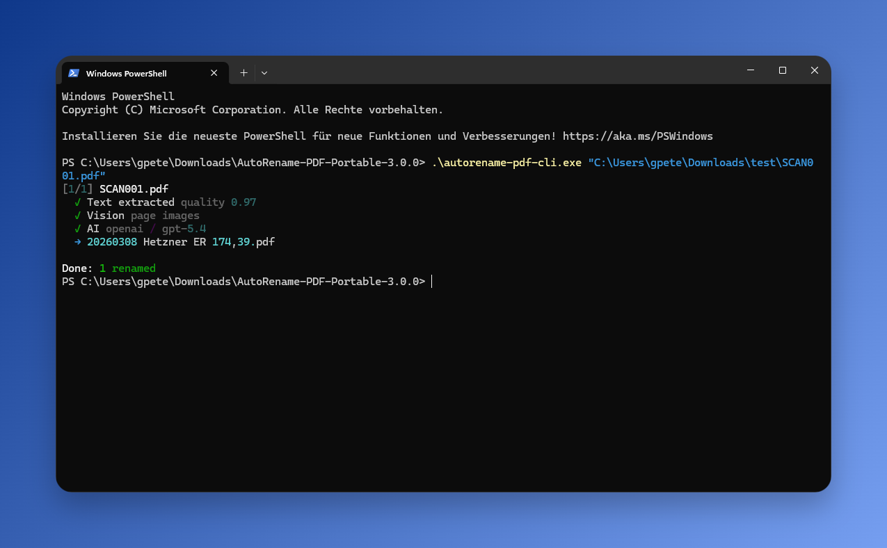

<div align="center">
  <h1>AutoRename-PDF</h1>
  <p><b>Automatically rename PDF files using AI and OCR.</b><br>
  Extracts company names, dates, and document types from any PDF — renames to <code>YYYYMMDD COMPANY DOCTYPE.pdf</code>.</p>
  <p>
    <a href="https://github.com/ptmrio/autorename-pdf/releases"></a>
    <a href="https://github.com/ptmrio/autorename-pdf/blob/main/LICENSE"></a>
    <a href="https://github.com/ptmrio/autorename-pdf/releases"></a>
    <a href="https://github.com/ptmrio/autorename-pdf/releases"></a>
  </p>
</div>


- **Desktop GUI** — Drag-and-drop files, preview renames before applying, undo if needed
- **5 AI Providers** — OpenAI, Anthropic (Claude), Google Gemini, xAI (Grok), and Ollama for free offline use
- **3-Tier Extraction** — Text extraction (free, instant) + OCR for scanned PDFs + vision for image-only PDFs
- **Windows Integration** — Right-click context menu in Windows Explorer for instant renaming
- **Batch Processing** — Rename hundreds of PDFs at once with automatic company name harmonization
- **Privacy Option** — Run fully offline with Ollama + PaddleOCR — no data leaves your machine

## Quick Start

1. **Download** the latest [release ZIP](https://github.com/ptmrio/autorename-pdf/releases)
2. **Extract** and run `setup.ps1` (right-click → "Run with PowerShell")
3. **Configure** — edit `config.yaml` with your AI provider and API key:
   ```yaml
   ai:
     provider: "openai"       # or anthropic, gemini, xai, ollama
     api_key: "your-key"
   ```
4. **Launch** `autorename-pdf-gui.exe` — or right-click any PDF in Explorer

> `setup.ps1` creates `config.yaml` from the template, adds context menu entries, and optionally installs PaddleOCR for offline OCR of scanned documents.

## Common Questions

**Does it work offline?**
Yes. Use Ollama (free, local AI) + PaddleOCR. No data leaves your machine, no API key needed. See [Ollama Setup](#ollama-setup).

**What types of PDFs does it handle?**
Any PDF: text-based (digital), scanned (OCR), or image-only (vision). All three extraction methods can run together.

**How much does it cost?**
The tool is free and open source. Cloud AI providers charge ~$0.001 per PDF. Ollama is completely free.

**Does it work on macOS or Linux?**
The CLI works cross-platform via Python. The GUI and context menu are Windows-only. See [macOS / Linux](#macos--linux).

<details>
<summary><strong>Table of Contents</strong></summary>

- [Configuration](#configuration)
  - [API Key Setup](#api-key-setup)
  - [Recommended Setups](#recommended-setups)
  - [Provider Models](#provider-models)
  - [Extraction Settings](#extraction-settings)
- [Usage](#usage)
  - [GUI](#gui)
  - [Context Menu](#context-menu)
  - [Command Line](#command-line)
- [Company Name Harmonization](#company-name-harmonization)
- [Ollama Setup](#ollama-setup)
- [macOS / Linux](#macos--linux)
- [Support the Project](#support-the-project)
- [Developer Documentation](#developer-documentation)

</details>

## Configuration

### API Key Setup

There are two ways to configure your API key:

**Method 1 — Directly in `config.yaml`** (simple, portable):

```yaml
ai:
  api_key: "sk-your-actual-key-here"
```

**Method 2 — Via environment variable** (secure, easy to switch providers):

```yaml
ai:
  api_key: "${OPENAI_API_KEY}"
```

Then create a `.env` file next to your `config.yaml`:

```
OPENAI_API_KEY=sk-your-actual-key-here
ANTHROPIC_API_KEY=sk-ant-your-key-here
```

The `${VAR_NAME}` syntax works in any string value in `config.yaml`. A `.env` file placed next to `config.yaml` is loaded automatically.

> **Tip:** Method 2 lets you store all your API keys in `.env` and switch providers in `config.yaml` by just changing the `${VAR_NAME}` reference. See `.env.example` for a template.

### Recommended Setups

Text extraction (pdfplumber) **always runs** — it's free and instant. OCR and vision are independent add-ons you enable based on your needs.

#### Cloud AI + PaddleOCR (Best Accuracy)

PaddleOCR runs locally for free, cloud AI handles smart extraction. Great for mixed document types.

```yaml
ai:
  provider: "openai"           # or anthropic, gemini, xai
  model: "gpt-5.4"
  api_key: "your-api-key"
pdf:
  ocr: true                    # PaddleOCR enhances scanned docs
  vision: false                # not needed — OCR covers it
```

**Cost:** ~$0.001/PDF. **Requires:** API key + PaddleOCR (~500 MB, installed via `setup.ps1`).

#### Cloud AI + Vision (No Local Setup)

No PaddleOCR needed — the LLM reads page images directly. Best for laptops or low-performance machines.

```yaml
ai:
  provider: "gemini"           # or openai, anthropic, xai
  model: "gemini-3.1-flash-lite"
  api_key: "your-api-key"
pdf:
  ocr: false
  vision: true                 # send page images to LLM
```

**Cost:** ~$0.002/PDF. **Requires:** API key + vision-capable model.

#### Fully Offline (Max Privacy)

Everything runs on your machine. No data leaves your computer, no API keys, no cost.

```yaml
ai:
  provider: "ollama"
  model: "qwen3:4b"            # fast, fits in 3 GB VRAM
  api_key: ""
pdf:
  ocr: true                    # PaddleOCR for scanned docs
  vision: false                # text models are faster
```

**Cost:** Free. **Requires:** [Ollama](#ollama-setup) + PaddleOCR.

### Provider Models

| Provider | Flagship Model | Budget Model |
|----------|---------------|-------------|
| OpenAI | `gpt-5.4` | `gpt-5-mini` |
| Anthropic | `claude-sonnet-4-6` | `claude-haiku-4-5-20251001` |
| Gemini | `gemini-3.1-flash-lite` | `gemini-3-flash-preview` |
| xAI | `grok-4.20-beta-0309-non-reasoning` | — |
| Ollama | `qwen3:8b` | `qwen3:4b` / `llama3.2:3b` |

See `config.yaml.example` for full documentation of all settings.

### Extraction Settings

| Setting | Values | Description |
|---------|--------|-------------|
| `pdf.ocr` | `false` / `true` / `"auto"` | PaddleOCR for scanned PDFs |
| `pdf.vision` | `false` / `true` / `"auto"` | Send page images to LLM |
| `pdf.text_quality_threshold` | `0.0` – `1.0` | Triggers OCR/vision in `"auto"` mode (default: `0.3`) |
| `pdf.max_pages` | integer | Max pages to process per PDF (default: `3`) |

- **`false`** = disabled (default for both)
- **`true`** = always run alongside text extraction
- **`"auto"`** = run only when text quality falls below threshold

All enabled sources are combined before sending to the AI — maximizing extraction accuracy.

## Usage

### GUI

Launch `autorename-pdf-gui.exe` to open the desktop interface.

- **Drag and drop** PDF files or folders onto the window
- **Dry-run preview** shows proposed renames before applying
- **Undo** reverses the last rename operation
- Supports light and dark themes

### Context Menu

After running `setup.ps1`, right-click in Windows Explorer:

- **Single PDF**: Right-click a PDF → `Auto Rename PDF`
- **Folder of PDFs**: Right-click a folder → `Auto Rename PDFs in Folder`
- **Current Folder**: Right-click folder background → `Auto Rename PDFs in This Folder`

> **Windows 11 Note:** Context menu entries appear under "Show more options" (Shift+F10).

### Command Line



```bash
# Rename a single PDF
autorename-pdf-cli.exe "C:\path\to\file.pdf"

# Preview what would be renamed (no changes made)
autorename-pdf-cli.exe --dry-run "C:\path\to\folder"

# Process folders recursively
autorename-pdf-cli.exe --recursive "C:\path\to\folder"

# Undo the last rename operation
autorename-pdf-cli.exe undo

# Override AI provider/model for one run
autorename-pdf-cli.exe --provider anthropic --model claude-sonnet-4-6 "file.pdf"

# Enable vision and/or OCR
autorename-pdf-cli.exe --vision --ocr "scanned_document.pdf"

# JSON output (for scripting / GUI integration)
autorename-pdf-cli.exe rename --output json "C:\path\to\folder"
```

<details>
<summary><strong>Full CLI Reference</strong></summary>

#### Subcommands

| Subcommand | Description |
|------------|-------------|
| `rename` | Rename PDF files (default if omitted) |
| `undo` | Reverse file renames using the undo log |
| `config show` | Display current configuration (API keys redacted) |
| `config validate` | Validate configuration and report issues |

#### Rename Options

| Flag | Description |
|------|-------------|
| `--dry-run` | Show what would be renamed without doing it |
| `--recursive`, `-r` | Process folders recursively |
| `--provider` | Override AI provider from config |
| `--model` | Override model from config |
| `--vision` | Enable vision (send page images to LLM) |
| `--ocr` | Enable PaddleOCR |
| `--text-only` | Disable OCR and vision (text extraction only) |
| `--output`, `-o` | Output format: `text` or `json` (default: auto-detect) |
| `--quiet`, `-q` | Suppress non-essential output |
| `--verbose`, `-v` | Show detailed processing info |

#### Undo Options

| Flag | Description |
|------|-------------|
| `--list` | List available undo batches without undoing |
| `--batch <id>` | Undo a specific batch by ID |
| `--all` | Undo all batches (not just the last one) |

#### Exit Codes

| Code | Meaning |
|------|---------|
| 0 | Success |
| 1 | General error |
| 2 | Usage error |
| 3 | Configuration error |
| 4 | No files found |
| 5 | Partial failure (some files failed) |
| 10 | AI provider error |
| 11 | Authentication error |

</details>

## Company Name Harmonization

Standardize company name variations using `harmonized-company-names.yaml`:

```yaml
ACME:
    - "ACME Corp"
    - "ACME Inc."
    - "ACME Corporation"

XYZ:
    - "XYZ Ltd"
    - "XYZ LLC"
    - "XYZ Enterprises"
```

The tool uses fuzzy matching (Jaro-Winkler similarity) to automatically map extracted names to their standardized form, even with OCR typos.

**Quick Tip:** Copy your PDF filenames, paste them into ChatGPT/Claude/Gemini with _"Create a harmonized-company-names.yaml mapping these company name variations to standardized names"_ — then save the result.

<a id="ollama-setup"></a>

<details>
<summary><strong>Ollama Setup (Free Local AI)</strong></summary>

Ollama runs AI models entirely on your machine — no API key, no cloud, no cost per request.

#### Recommended Models

| Model | VRAM | Best for | Download |
|-------|------|----------|----------|
| `qwen3:8b` | ~5 GB | Most PDFs (text extraction) | ~5 GB |
| `qwen3-vl:8b` | ~6 GB | Scanned/image PDFs (vision) | ~6 GB |
| `qwen3:4b` | ~3 GB | Budget GPU / less VRAM | ~2.5 GB |
| `llama3.2:3b` | ~2.5 GB | Minimal hardware | ~2 GB |

#### Setup

1. **Install Ollama:**
   ```powershell
   winget install -e --id Ollama.Ollama
   ```
   Or download from [ollama.com/download](https://ollama.com/download).

2. **Pull a model:**
   ```powershell
   ollama pull qwen3:4b
   ```

3. **Configure** `config.yaml`:
   ```yaml
   ai:
     provider: "ollama"
     model: "qwen3:4b"
     api_key: ""
   ```

**Requirements:** Windows 10 22H2+ or Windows 11. GPU with 6+ GB VRAM recommended (works CPU-only with 16+ GB RAM but slower). See [ollama.com](https://ollama.com) for troubleshooting, GPU setup, and model management.

</details>

<a id="macos--linux"></a>

<details>
<summary><strong>macOS / Linux (Run from Python Source)</strong></summary>

The CLI works cross-platform via Python. The GUI and context menu are Windows-only.

```bash
# Clone and set up
git clone https://github.com/ptmrio/autorename-pdf.git
cd autorename-pdf
python -m venv venv
source venv/bin/activate
pip install -r requirements.txt

# Copy and edit config
cp config.yaml.example config.yaml
# Edit config.yaml with your AI key and provider

# Run
python autorename-pdf.py --dry-run invoice.pdf
python autorename-pdf.py invoice.pdf
```

**Platform notes:**
- PaddleOCR venv path defaults to `~/.local/share/autorename-pdf/paddleocr-venv`
- Log files are written to `~/.local/share/autorename-pdf/`
- All core functionality (text extraction, AI processing, renaming) works cross-platform

</details>

## Support the Project

If AutoRename-PDF saves you time, consider supporting its development:

- ⭐ [Star this repo](https://github.com/ptmrio/autorename-pdf) on GitHub
- 💖 [Sponsor on GitHub](https://github.com/sponsors/ptmrio)
- ☕ [Buy me a coffee on Ko-fi](https://ko-fi.com/spqrk)
- 💛 [Donate via PayPal](https://paypal.me/realSPQRK)

Also check out [PhraseVault](https://phrasevault.app) — a text expander and snippet manager by the same developer.

### Thank You to Our Supporters

- [@claus82](https://github.com/claus82) — Thank you for your generous donation!

<a id="developer-documentation"></a>

<details>
<summary><strong>Developer Documentation</strong></summary>

## Development Setup

**Prerequisites:** Python 3.11+, Git

```bash
git clone https://github.com/ptmrio/autorename-pdf.git
cd autorename-pdf
python -m venv venv
source venv/bin/activate        # Linux/macOS
# venv\Scripts\activate         # Windows
pip install -r requirements.txt
pip install -r requirements-dev.txt  # for testing
cp config.yaml.example config.yaml
```

## Architecture

Functional Python (no classes). Modules prefixed with `_` are internal:

| Module | Purpose |
|--------|---------|
| `autorename-pdf.py` | Entry point, CLI (argparse), orchestration |
| `_ai_processing.py` | Multi-provider AI via instructor, structured output (Pydantic) |
| `_pdf_utils.py` | Text extraction (pdfplumber), image rendering (pypdfium2), PaddleOCR bridge |
| `_paddleocr_bridge.py` | Subprocess bridge script for PaddleOCR venv |
| `_document_processing.py` | Company harmonization (rapidfuzz), renaming, undo log |
| `_config_loader.py` | YAML v2 config loading, schema validation, defaults |
| `_utils.py` | Filename validation, constants |

## AI Providers (Technical)

All providers use [instructor](https://github.com/jxnl/instructor) for structured Pydantic output.

| Provider | SDK | Notes |
|----------|-----|-------|
| `openai` | openai (native) | Default |
| `anthropic` | anthropic (native) | Uses `instructor.from_anthropic()` — Anthropic's OpenAI compat layer ignores structured output |
| `gemini` | openai (base_url) | Google's OpenAI-compatible endpoint |
| `xai` | openai (base_url) | Grok models |
| `ollama` | openai (base_url) | Local models, no API key needed |

## Testing

```bash
pytest tests/ -v --cov
```

Unit tests mock AI API calls. Business logic (harmonization, date parsing, filename generation) should have >80% coverage.

### Live Tests

```bash
pytest tests/ --run-live -v                       # All available providers
pytest tests/ --run-live --provider ollama -v      # Free, local only
pytest tests/ --run-live --provider openai -v      # OpenAI only
pytest tests/ --run-live --provider anthropic -v   # Anthropic only
```

API keys are loaded from `.env` file (see `.env.example`). Ollama tests require Ollama running locally.

## Building

```bash
python build.py                  # Build everything, sign all
python build.py --nosign         # Build everything, skip signing
python build.py --cli-only       # Build CLI EXE only (skip GUI + packaging)
```

**Build pipeline:** CLI EXE (PyInstaller) → Sign (Azure Trusted Signing) → Tauri GUI → Portable ZIP

**Output** (in `Releases/`): `AutoRename-PDF-Portable-{version}.zip`

## Contributing

We're currently not accepting direct contributions to maintain project consistency. You're welcome to:

- **Open an issue** to report bugs, request features, or ask questions
- **Create your own fork** to customize the tool for your needs
- **Share feedback** about your experience using the tool

</details>

---

MIT License — Made by [Gerhard Petermeir, SPQRK Web Solutions](https://github.com/ptmrio)
