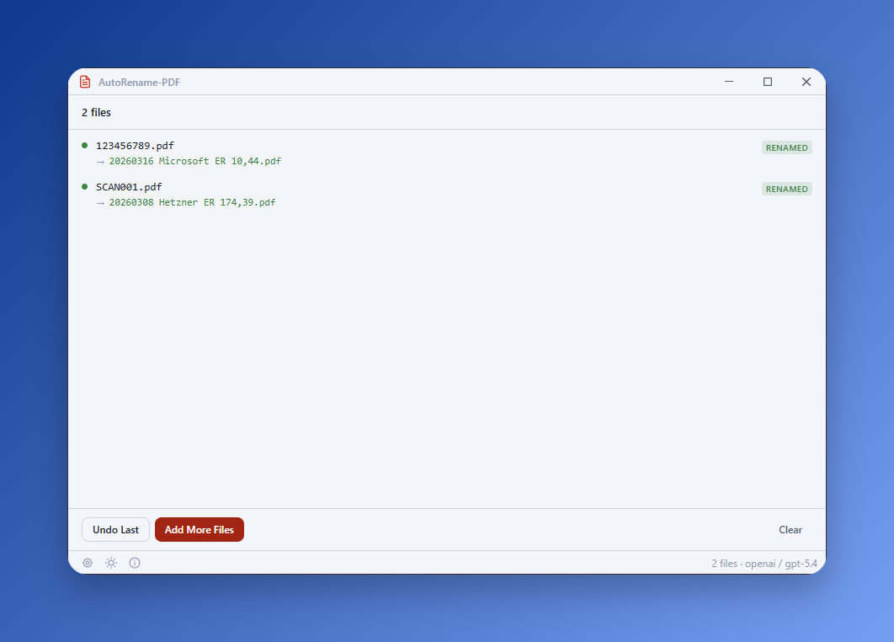
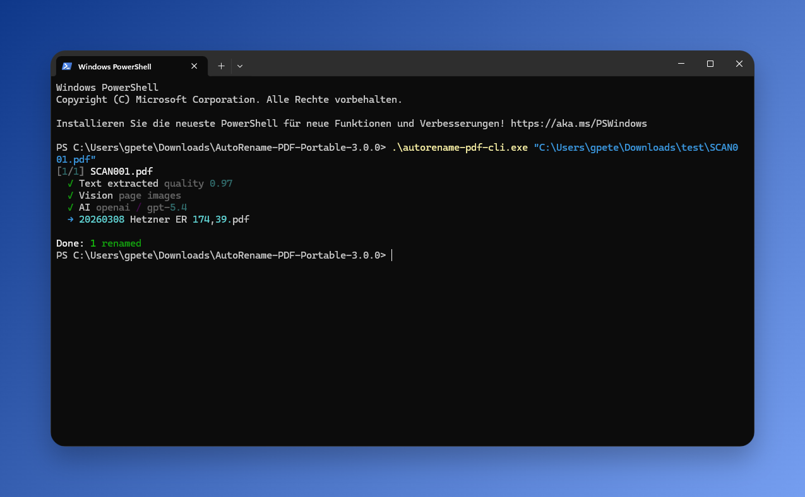

<div align="center">
  <h1>AutoRename-PDF</h1>
  <p><b>AI PDF renamer for invoices, scanned documents, and academic papers.</b><br>
  Turn PDF contents into filenames like <code>20260906 ACME AP 12,13.pdf</code>.</p>
  <p>
    <a href="https://github.com/ptmrio/autorename-pdf/releases"></a>
    <a href="https://github.com/ptmrio/autorename-pdf/blob/main/LICENSE"></a>
    <a href="https://github.com/ptmrio/autorename-pdf/releases"></a>
    <a href="https://github.com/ptmrio/autorename-pdf/releases"></a>
  </p>
</div>

Batch rename invoices and other PDFs from their contents with a Windows drag-and-drop GUI, a right-click action in Windows Explorer, or a cross-platform Python CLI. Preview names before applying them, undo a batch, and keep company names consistent with fuzzy-matched aliases. Business filenames include the date, company, document type, and printed invoice total; an academic profile names papers by date, author, venue, and title.

Use OpenAI, Anthropic (Claude), Google Gemini, xAI (Grok), or a local LLM through Ollama. Text extraction, PaddleOCR, and vision cover digital, scanned, and image-only PDFs. Ollama + local PaddleOCR support fully offline processing once installed. Invoice codes default to **AP/AR**. For German bookkeeping workflows (Rechnungen umbenennen), switch to [DATEV-style ER/AR codes](#invoice-naming-apar-and-datev-style-erar).

| Start here | What you need |
|------------|---------------|
| [Windows ZIP / GUI](#quick-start) | Download the release, run setup, then drag in PDFs or use Explorer. GUI and context-menu EXE are Windows-only. |
| [Private, offline renaming](#ollama-setup) | Run Ollama + PaddleOCR locally, with no API key or per-request fee. |
| [Python CLI on macOS / Linux](#macos--linux) | Install from source for batch renaming, dry-run, and JSON output. |
| [Developer setup](#developer-documentation) | Find architecture, tests, builds, and AI tool integration. |



## Contents

- [Windows quick start](#quick-start) · [Common questions](#common-questions)
- [Configuration](#configuration): [API keys](#api-key-setup) · [Cloud or local setups](#recommended-setups) · [Provider models](#provider-models)
- [OCR and vision for scanned PDFs](#extraction-settings) · [Invoice naming: AP/AR and DATEV-style ER/AR](#invoice-naming-apar-and-datev-style-erar)
- [Extraction profiles](#dynamic-extraction-profiles): [Business filenames and printed amounts](#business-filenames-and-printed-amounts) · [Academic papers](#academic-paper-naming) · [Custom templates and fields](#custom-templates-and-fields)
- [Usage](#usage): [Windows GUI](#gui) · [Windows Explorer](#context-menu) · [Command line and JSON](#command-line) · [Preview, undo, and skipping](#dry-run-preview-undo-and-already-correct-files) · [Full CLI reference](#full-cli-reference)
- [Company name harmonization](#company-name-harmonization) · [Offline Ollama setup](#ollama-setup) · [Python on macOS / Linux](#macos--linux)
- [Developer documentation](#developer-documentation): [Setup](#development-setup) · [Architecture](#architecture) · [Tests](#testing) · [Builds](#building) · [Contributing](#contributing)
- [Support the project](#support-the-project) · [MIT license](LICENSE)

<a id="quick-start"></a>

## Windows Quick Start: ZIP, GUI, and Explorer

1. **Download** the latest [release ZIP](https://github.com/ptmrio/autorename-pdf/releases)
2. **Extract** and run `setup.ps1` (right-click → "Run with PowerShell")
3. **Configure** — edit `config.yaml` with your AI provider and API key:
   ```yaml
   ai:
     provider: "openai"       # or anthropic, gemini, xai, ollama
     api_key: "your-key"
   ```
4. **Launch** `autorename-pdf-gui.exe` — or right-click any PDF in Explorer

> `setup.ps1` creates `config.yaml` from the template if it is missing, offers to add context menu entries, and optionally installs PaddleOCR for offline OCR of scanned documents.
>
> Run `setup.ps1` from normal PowerShell, without "Run as Administrator". Only choosing to install or remove Explorer context menus requests UAC. Config creation and PaddleOCR installation/removal stay under your original Windows user, including when another administrator approves UAC. Already-elevated interactive setup asks you to rerun normally.

## Common Questions

**Does it work offline?**
Yes. Use Ollama (free, local AI) + PaddleOCR on your machine. After downloading the software and models, local processing needs no cloud connection or API key. See [Ollama Setup](#ollama-setup).

**What types of PDFs does it handle?**
It handles text-based (digital), scanned (OCR), and image-only (vision) PDFs. All three extraction methods can run together. See [OCR and vision settings](#extraction-settings).

**How much does it cost?**
The tool is free and open source. The cloud text/OCR setup below has a rough estimate of ~$0.001 per PDF; actual charges depend on the provider, model, and document. Ollama has no API fee. See [cloud and offline setups](#recommended-setups).

**Does it work on macOS or Linux?**
The CLI works cross-platform via Python. The GUI and context menu are Windows-only. See [macOS / Linux](#macos--linux).

**Can I check names before renaming, or undo a batch?**
Yes. Use the GUI preview or CLI `--dry-run`, then undo a completed batch if needed. Files whose names already match the extracted result are skipped. See [preview and undo](#dry-run-preview-undo-and-already-correct-files).

**Can I name research papers or change the filename format?**
Yes. Choose the built-in academic profile or customize fields and templates in YAML. See [extraction profiles](#dynamic-extraction-profiles).

## Configuration

### API Key Setup

There are two ways to configure your API key:

**Method 1 — Directly in `config.yaml`** (simple, portable):

```yaml
ai:
  api_key: "sk-your-actual-key-here"
```

**Method 2 — Via environment variable** (secure, easy to switch providers):

```yaml
ai:
  api_key: "${OPENAI_API_KEY}"
```

Then create a `.env` file next to your `config.yaml`:

```
OPENAI_API_KEY=sk-your-actual-key-here
ANTHROPIC_API_KEY=sk-ant-your-key-here
```

The `${VAR_NAME}` syntax works in any string value in `config.yaml`. A `.env` file placed next to `config.yaml` is loaded automatically.

> **Tip:** Method 2 lets you store all your API keys in `.env` and switch providers in `config.yaml` by just changing the `${VAR_NAME}` reference. See `.env.example` for a template.

### Recommended Setups

Text extraction (pdfplumber) **always runs** — it's free and instant. OCR and vision are independent add-ons you enable based on your needs.

<a id="cloud-ai--paddleocr-best-accuracy"></a>

#### Cloud AI + PaddleOCR for Mixed Documents

PaddleOCR runs locally for free, cloud AI handles smart extraction. Great for mixed document types.

```yaml
ai:
  provider: "openai"           # or anthropic, gemini, xai
  model: "gpt-5.6-luna"
  api_key: "your-api-key"
pdf:
  ocr: true                    # PaddleOCR enhances scanned docs
  vision: false                # not needed — OCR covers it
```

**Estimated cost:** ~$0.001/PDF, depending on model and document. **Requires:** API key + PaddleOCR (~500 MB, installed via `setup.ps1`).

#### Cloud AI + Vision (No Local Setup)

No PaddleOCR needed — the LLM reads page images directly. Best for laptops or low-performance machines.

```yaml
ai:
  provider: "gemini"           # or openai, anthropic, xai
  model: "gemini-3.1-flash-lite"
  api_key: "your-api-key"
pdf:
  ocr: false
  vision: true                 # send page images to LLM
```

**Estimated cost:** ~$0.002/PDF, depending on model and document. **Requires:** API key + vision-capable model.

#### Fully Offline (Max Privacy)

Everything runs on your machine once the software and models are downloaded. With a local Ollama endpoint and local PaddleOCR, no document data leaves your computer and there are no API keys or per-request charges.

```yaml
ai:
  provider: "ollama"
  model: "qwen3:4b"            # fast, fits in 3 GB VRAM
  api_key: ""
pdf:
  ocr: true                    # PaddleOCR for scanned docs
  vision: false                # text models are faster
```

**Cost:** Free. **Requires:** [Ollama](#ollama-setup) + PaddleOCR.

### Provider Models

| Provider | Flagship Model | Budget Model |
|----------|---------------|-------------|
| OpenAI | `gpt-5.6-luna` | `gpt-5-mini` |
| Anthropic | `claude-sonnet-4-6` | `claude-haiku-4-5-20251001` |
| Gemini | `gemini-3.1-flash-lite` | `gemini-3-flash-preview` |
| xAI | `grok-4.20-beta-0309-non-reasoning` | — |
| Ollama | `qwen3:8b` | `qwen3:4b` / `llama3.2:3b` |

See [config.yaml.example](config.yaml.example) for full documentation of all settings.

<a id="extraction-settings"></a>

### OCR and Vision for Scanned PDF Filenames

| Setting | Values | Description |
|---------|--------|-------------|
| `pdf.ocr` | `false` / `true` / `"auto"` | PaddleOCR for scanned PDFs |
| `pdf.vision` | `false` / `true` / `"auto"` | Send page images to LLM |
| `pdf.text_quality_threshold` | `0.0` – `1.0` | Triggers OCR/vision in `"auto"` mode (default: `0.3`) |
| `pdf.max_pages` | integer | Max pages to process per PDF (default: `3`) |

- **`false`** = disabled (default for both)
- **`true`** = always run alongside text extraction
- **`"auto"`** = run only when text quality falls below threshold

All enabled sources are combined before sending to the selected AI. PaddleOCR reads page text locally; vision sends page images to a vision-capable model. OCR and vision are independent, so you can enable either or both.

### Invoice Naming: AP/AR and DATEV-style ER/AR

For invoice batches, set `company.name` to your own company so the AI can distinguish your business from the counterparty. Use [company aliases](#company-name-harmonization) to standardize extracted vendor and customer names.

Invoice type codes default to `AP` (Accounts Payable — vendor bills you
receive) and `AR` (Accounts Receivable — invoices you send). There is no ISO
filename standard for incoming vs outgoing invoices; `II`/`OI` is not used in
accounting systems (`OI` usually means open items in SAP). Restore German
DATEV-style codes with:

```yaml
pdf:
  incoming_invoice: ER   # Eingangsrechnung
  outgoing_invoice: AR   # Ausgangsrechnung
```

<a id="dynamic-extraction-profiles"></a>

### Extraction Profiles: Business, Academic, and Custom

#### Business Filenames and Printed Amounts

The default business filename now includes a fourth component:
`20260906 ACME AP 12,13.pdf`. Invoice types use the `pdf.incoming_invoice` /
`pdf.outgoing_invoice` codes (default AP / AR). They already identify the
document type. The description copies the printed final total; if no total is
printed, the filename is `20260906 ACME AP.pdf`. Currency is kept only when
printed with the amount. Non-invoices copy an explicit subject/title in its
original language instead of generating a summary.

Existing v2 configs still load, but generated names and prompts intentionally
change. Remove old prompt extensions that append the amount to document_type
when adopting this default, or an amount may appear twice (`AP 12,13 12,13`).
Your config and prompt_extension are never silently rewritten or filtered.

#### Academic Paper Naming

Set `profile: business` or `profile: academic` in config. A run can override
that selection with `rename <path> --profile academic` without saving config.
Academic filenames use date, first author's surname, venue, and full printed
title with spaces; absent venue disappears. A printed year alone normalizes
to January 1 of that year, not evidence of the publication day.

#### Custom Templates and Fields

All extraction fields are required strings; missing values are empty strings.
JSON adds `profile` and raw `fields` to each file result. These values survive
filename sanitization, harmonization, and truncation. Templates contain field
names in braces, omit `.pdf`, and cannot contain paths. Escape literal braces
as `{{` and `}}`. `truncate_field` names the non-date template field shortened
first; `harmonize_field` optionally selects one company/issuer field for the
existing company aliases. Academic does not use company aliases.

Merge a chosen overlay into your existing single `profiles` mapping; duplicate
YAML keys are errors. Same-name overlays replace scalar settings, keep the
order of existing fields, append new fields, and use `field: null` for
deletion. Date cannot be deleted; references must be repaired. Custom
`extends` can name a built-in or an earlier custom profile and inherits the
parent's user overlay. There is no separate profile file directory.
`config validate` checks all profiles, `config show` includes resolved
selection, and `output.date_format` applies across profiles.

Restore the three-component shape with **both** settings (this does not restore
generated non-invoice summaries):

```yaml
profiles:
  business:
    template: "{document_date} {company_name} {document_type}"
    truncate_field: company_name
```

Keep the printed amount and add an invoice number:

```yaml
profiles:
  business:
    fields:
      invoice_id:
        description: "Copy the printed invoice number exactly, without an Invoice or Rechnung label. Empty if absent or the document is not an invoice."
    template: "{document_date} {company_name} {document_type} {description} {invoice_id}"
    truncate_field: description
```

The latter retains the inherited amount in description and produces
`20260906 ACME AP 12,13 12345.pdf`.

Inherit business fields into a receipts profile, or declare a standalone
two-field profile:

```yaml
profile: receipts
profiles:
  business:
    fields:
      city:
        description: "City in the counterparty address, as printed. Empty if absent."
  receipts:
    extends: business
    intro: "You are naming a purchase receipt."
    fields:
      document_type: null
      description: null
      short_title:
        description: "Copy a purchase title explicitly printed on the receipt. Empty if absent."
    template: "{document_date}_{company_name}_{city}_{short_title}"
    truncate_field: short_title
    harmonize_field: company_name
```

```yaml
profile: notes
profiles:
  notes:
    fields:
      document_date:
        description: "Copy the printed date as dd.mm.YYYY. Empty if absent."
      title:
        description: "Copy the explicit title verbatim. Empty if absent."
    template: "{document_date} {title}"
    truncate_field: title
```

## Usage

<a id="gui"></a>

### Windows GUI: Drag, Preview, and Rename

Launch `autorename-pdf-gui.exe` and drag PDF files or folders onto the window. Use the dry-run preview to inspect proposed names before applying them, and Undo to reverse the last rename operation. The interface supports light and dark themes.

The settings view displays your provider, PDF processing, OCR, company, and output settings. It can validate the configuration and open its folder; edit `config.yaml` to change settings.

<a id="context-menu"></a>

### Rename PDFs from Windows Explorer

After choosing to install context menu entries in `setup.ps1`, right-click in Windows Explorer:

- **Single PDF**: Right-click a PDF → `Auto Rename PDF`
- **Folder of PDFs**: Right-click a folder → `Auto Rename PDFs in Folder`
- **Current Folder**: Right-click folder background → `Auto Rename PDFs in This Folder`

> **Windows 11 Note:** Context menu entries appear under "Show more options" (Shift+F10).

<a id="command-line"></a>

### Command Line: Batch Rename PDFs and Export JSON

Process a single file or hundreds of PDFs in folders, with `--recursive` for subfolders. The examples below use the Windows EXE; Python users can replace `autorename-pdf-cli.exe` with `python autorename-pdf.py` after [installing from source](#macos--linux).



```bash
# Rename a single PDF
autorename-pdf-cli.exe "C:\path\to\file.pdf"

# Preview what would be renamed (no changes made)
autorename-pdf-cli.exe --dry-run "C:\path\to\folder"

# Process folders recursively
autorename-pdf-cli.exe --recursive "C:\path\to\folder"

# Undo the last rename operation
autorename-pdf-cli.exe undo

# Override AI provider/model for one run
autorename-pdf-cli.exe --provider anthropic --model claude-sonnet-4-6 "file.pdf"

# Use the academic profile for one run without saving config
autorename-pdf-cli.exe rename --profile academic "paper.pdf"

# Enable vision and/or OCR
autorename-pdf-cli.exe --vision --ocr "scanned_document.pdf"

# JSON output (for scripting / GUI integration)
autorename-pdf-cli.exe rename --output json "C:\path\to\folder"
```

JSON output includes batch counts (`total`, `renamed`, `skipped`, `failed`), `success`, `dry_run`, `batch_id`, and per-file results in `files`. Each file includes its selected `profile` and raw extraction `fields`, so scripts can use the metadata independently of the final filename. See [profile field behavior](#custom-templates-and-fields) and [exit codes](#exit-codes).

### Dry-run Preview, Undo, and Already-correct Files

Use `--dry-run` to inspect the proposed names without changing files, or use the GUI preview and then apply its cached results. A file is skipped when its existing name already matches the generated name. The CLI `undo` command reverses the last batch; `undo --list`, `undo --batch <id>`, and `undo --all` let you inspect or restore earlier batches.

<a id="full-cli-reference"></a>

<details>
<summary><strong>Full CLI Reference</strong></summary>

#### Subcommands

| Subcommand | Description |
|------------|-------------|
| `rename` | Rename PDF files (default if omitted) |
| `undo` | Reverse file renames using the undo log |
| `config show` | Display current configuration (API keys redacted) |
| `config validate` | Validate configuration and report issues |

#### Rename Options

| Flag | Description |
|------|-------------|
| `--dry-run` | Show what would be renamed without doing it |
| `--recursive`, `-r` | Process folders recursively |
| `--provider` | Override AI provider from config |
| `--model` | Override model from config |
| `--vision` | Enable vision (send page images to LLM) |
| `--ocr` | Enable PaddleOCR |
| `--text-only` | Disable OCR and vision (text extraction only) |
| `--profile` | Extraction profile id (overrides config for this run) |
| `--output`, `-o` | Output format: `text` or `json` (default: auto-detect) |
| `--quiet`, `-q` | Suppress non-essential output |
| `--verbose`, `-v` | Show detailed processing info |
| `--config` | Path to `config.yaml` (default: auto-detect from EXE/script directory) |

#### Undo Options

| Flag | Description |
|------|-------------|
| `--list` | List available undo batches without undoing |
| `--batch <id>` | Undo a specific batch by ID |
| `--all` | Undo all batches (not just the last one) |

#### Exit Codes

| Code | Meaning |
|------|---------|
| 0 | Success |
| 1 | General error |
| 2 | Usage error |
| 3 | Configuration error |
| 4 | No files found |
| 5 | Partial failure (some files failed) |
| 10 | AI provider error |
| 11 | Authentication error |

</details>

## Company Name Harmonization

Standardize company name variations using `harmonized-company-names.yaml`. Start with [the example mapping](harmonized-company-names.yaml.example), then add your preferred names and aliases:

```yaml
ACME:
    - "ACME Corp"
    - "ACME Inc."
    - "ACME Corporation"

XYZ:
    - "XYZ Ltd"
    - "XYZ LLC"
    - "XYZ Enterprises"
```

The tool uses fuzzy matching (Jaro-Winkler similarity) to automatically map extracted names to their standardized form, even with OCR typos.

**Quick Tip:** Copy your PDF filenames, paste them into ChatGPT/Claude/Gemini with _"Create a harmonized-company-names.yaml mapping these company name variations to standardized names"_ — then save the result.

<a id="ollama-setup"></a>

## Offline PDF Renaming with Ollama and PaddleOCR

Ollama runs local LLMs on your machine — no API key, no cloud, no cost per request. Pair it with PaddleOCR to rename scanned PDFs offline, using the [fully offline configuration](#fully-offline-max-privacy). Download the software and models before going offline, and keep Ollama running locally.

### Recommended Models

| Model | VRAM | Best for | Download |
|-------|------|----------|----------|
| `qwen3:8b` | ~5 GB | Most PDFs (text extraction) | ~5 GB |
| `qwen3-vl:8b` | ~6 GB | Scanned/image PDFs (vision) | ~6 GB |
| `qwen3:4b` | ~3 GB | Budget GPU / less VRAM | ~2.5 GB |
| `llama3.2:3b` | ~2.5 GB | Minimal hardware | ~2 GB |

### Setup

1. **Install Ollama:**
   ```powershell
   winget install -e --id Ollama.Ollama
   ```
   Or download from [ollama.com/download](https://ollama.com/download).

2. **Pull a model:**
   ```powershell
   ollama pull qwen3:4b
   ```

3. **Configure** `config.yaml`:
   ```yaml
   ai:
     provider: "ollama"
     model: "qwen3:4b"
     api_key: ""
   ```

**Windows requirements:** Windows 10 22H2+ or Windows 11. GPU with 6+ GB VRAM recommended (works CPU-only with 16+ GB RAM but slower). See [ollama.com](https://ollama.com) for troubleshooting, GPU setup, and model management.

<a id="macos--linux"></a>

## Python CLI on macOS / Linux

The CLI works cross-platform via Python 3.11+. The GUI and context menu are Windows-only.

```bash
# Clone and set up
git clone https://github.com/ptmrio/autorename-pdf.git
cd autorename-pdf
python -m venv venv
source venv/bin/activate
pip install -r requirements.txt

# Copy and edit config
cp config.yaml.example config.yaml
# Edit config.yaml with your AI key and provider

# Run
python autorename-pdf.py --dry-run invoice.pdf
python autorename-pdf.py invoice.pdf
```

**Platform notes:**
- PaddleOCR venv path defaults to `~/.local/share/autorename-pdf/paddleocr-venv`
- Log files are written to `~/.local/share/autorename-pdf/`
- All core functionality (text extraction, AI processing, renaming) works cross-platform

## Support the Project

If AutoRename-PDF saves you time, consider supporting its development:

- ⭐ [Star this repo](https://github.com/ptmrio/autorename-pdf) on GitHub
- 💖 [Sponsor on GitHub](https://github.com/sponsors/ptmrio)
- ☕ [Buy me a coffee on Ko-fi](https://ko-fi.com/spqrk)
- 💛 [Donate via PayPal](https://paypal.me/realSPQRK)

Also check out [PhraseVault](https://phrasevault.app) — a text expander and snippet manager by the same developer.

### Thank You to Our Supporters

- [@claus82](https://github.com/claus82) — Thank you for your generous donation!

<a id="developer-documentation"></a>

## Developer Documentation

### Development Setup

**Prerequisites:** Python 3.11+ (CLI floor), Git. Optional OCR embed is Python 3.13.15 with PaddlePaddle 3.3.1 / PaddleOCR 3.7.0 (`PP-OCRv6_small` defaults).

```bash
git clone https://github.com/ptmrio/autorename-pdf.git
cd autorename-pdf
python -m venv venv
source venv/bin/activate        # Linux/macOS
# venv\Scripts\activate         # Windows
pip install -r requirements.txt
pip install -r requirements-dev.txt  # for testing
cp config.yaml.example config.yaml
```

### Architecture

The Python core uses a functional style. Modules prefixed with `_` are internal:

| Module | Purpose |
|--------|---------|
| `autorename-pdf.py` | Entry point, CLI (argparse), orchestration |
| `_ai_processing.py` | Multi-provider AI: native structured parse (OpenAI/Anthropic) or instructor (Gemini/xAI/Ollama) |
| `_pdf_utils.py` | Text extraction (pdfplumber), image rendering (pypdfium2), PaddleOCR bridge |
| `_paddleocr_bridge.py` | Subprocess bridge script for PaddleOCR venv |
| `_document_processing.py` | Company harmonization (rapidfuzz), renaming, undo log |
| `_config_loader.py` | YAML v2 config loading, schema validation, defaults |
| `_utils.py` | Filename validation, constants |

### AI Providers (Technical)

OpenAI and Anthropic use native structured parse. [Instructor](https://github.com/jxnl/instructor) is used only for Gemini, xAI, and Ollama.

| Provider | SDK | Notes |
|----------|-----|-------|
| `openai` | openai (native) | Default. Native `responses.parse`. Default model `gpt-5.6-luna`. |
| `anthropic` | anthropic (native) | Native `messages.parse`. OpenAI-compat layer ignores structured output. |
| `gemini` | openai (base_url) | Instructor TOOLS mode via Google's OpenAI-compatible endpoint |
| `xai` | openai (base_url) | Instructor TOOLS mode |
| `ollama` | openai (base_url) | Instructor JSON mode, local models, no API key needed |

### Testing

```bash
python -m ruff check .
pytest tests/ -v --cov
```

Unit tests mock AI API calls. Business logic (harmonization, date parsing, filename generation) should have >80% coverage.

#### Live Tests

```bash
pytest tests/ --run-live -v                       # All available providers
pytest tests/ --run-live --provider ollama -v      # Free, local only
pytest tests/ --run-live --provider openai -v      # OpenAI only
pytest tests/ --run-live --provider anthropic -v   # Anthropic only
```

API keys are loaded from `.env` file (see `.env.example`). Ollama tests require Ollama running locally.

### Building

```bash
python build.py                  # Build everything, sign all
python build.py --nosign         # Build everything, skip signing
python build.py --cli-only       # Build CLI EXE only (skip GUI + packaging)
```

**Build pipeline:** CLI EXE (PyInstaller) → Sign (Azure Trusted Signing) → Tauri GUI → Portable ZIP

**Output** (in `Releases/`): `AutoRename-PDF-Portable-{version}.zip`

### AI-Assisted Development

This repository is **AI-ready** — it includes configuration and skills for [Claude Code](https://claude.ai/code) and compatible AI tools (Cursor, Gemini CLI, Codex CLI, etc.).

**What's included in `.claude/`:**

| Path | Purpose |
|------|---------|
| `CLAUDE.md` | Codebase context — architecture, commands, conventions |
| `.claude/settings.json` | Shared permissions for common dev operations |
| `.claude/skills/` | 4 slash-command skills (see below) |
| `.claude/agents/pdf-debugger.md` | Specialized agent for diagnosing PDF processing issues |

**Available skills:**

| Skill | Description |
|-------|-------------|
| `/rename-pdfs <path>` | Rename PDFs from Python source (dev / cross-platform) |
| `/rename-pdfs-exe <path>` | Rename PDFs using compiled EXE (production / Windows) |
| `/build` | Build EXE + distribution ZIP |
| `/test [pattern]` | Run test suite with coverage |

**For end users** (release ZIP): The `rename-pdfs-exe` skill is included in the ZIP. Copy `.claude/skills/rename-pdfs-exe/` to `~/.claude/skills/` for global availability across all your projects.

The [SKILL.md format](https://docs.anthropic.com/en/docs/claude-code/skills) is an open standard — these skills work with any AI tool that supports it.

### Contributing

We're currently not accepting direct contributions to maintain project consistency. You're welcome to:

- **Open an issue** to report bugs, request features, or ask questions
- **Create your own fork** to customize the tool for your needs
- **Share feedback** about your experience using the tool

---

MIT License — Made by [Gerhard Petermeir, SPQRK Web Solutions](https://github.com/ptmrio)
